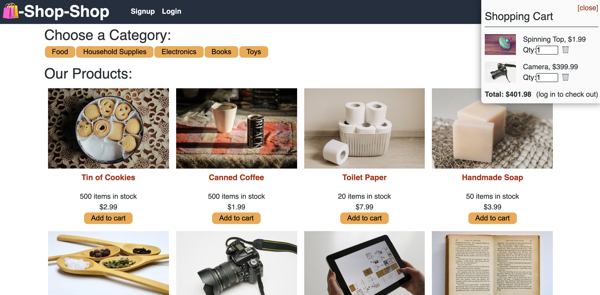

# Shop-Shop Redux Store
  
## Contents
  
* [Description](#description)
* [Installation](#installation)
* [Screenshots](#screenshots)
* [Questions](#questions)
    
## [Description](#Contents)
  
This application takes an e-commerce site and uses Redux to manage global state rather than the Context API.

[Deployed Application](https://young-inlet-18967.herokuapp.com/)
  
## [Installation](#Contents)
  
Clone this repository onto your computer. From the command line, initialize the node package manager by running `npm init`. To install dependencies, run `npm install`. To start running this application locally, run `npm run build` and `npm run develop`.

## [Screenshots](#Contents)

  
  
## [Questions](#Contents)
  
You can contact me by clicking the following links!
  
[Email: caseynlister@gmail.com](mailto:caseynlister@gmail.com)
  
[GitHub](https://github.com/caseylister)
